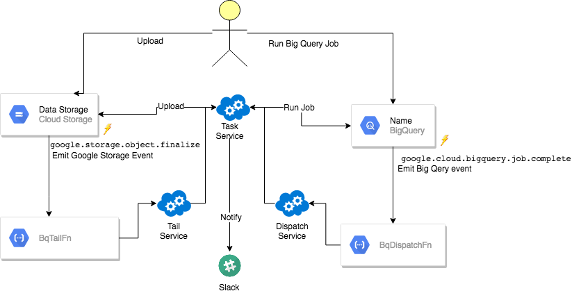
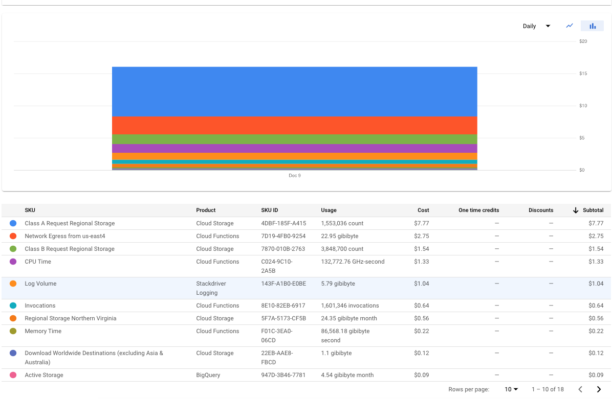

# BigQuery Google Storage Based Data Loader (bqtail) 

This library is compatible with Go 1.11+

Please refer to [`CHANGELOG.md`](CHANGELOG.md) if you encounter breaking changes.

- [Motivation](#motivation)
- [Introduction](#introduction)
- [Tail Service](tail/README.md)
- [Dispatch Service](dispatch/README.md)
- [Usage](#usage)
- [End to end testing](#end-to-end-testing)


## Motivation

The goal of this project is to provide a single point of robust and cost-effective events driven, data ingestion to Big Query.
BqTail elegantly addresses  BigQuery limitations/restriction/quotas (load jobs per table, project, corrupted data files) with batching and transient project(s)/dataset approach.
In addition it also provides data transformation enrichment and deduplication capabilities.

A single point means that there is only one deployment instance of bqtai/dispatch/monitor to ingest data to various BigQuery projects,  
where each ingestion process can use a dedicated one or more transient projects to control billing, reservation, or default-pipeline workload.
The transient project function is to load data to a temp table, run the optional transformation, and copy data to a destination table.

Having a dedicated project only for loading data, allowed us to identify intermittent loading capacity limitations on default-pipeline, with BqTail monitor 
 reporting every ingestion process in real-time with the worst-case scenario end to end process ingestion time.
In some cases, we've seen delays up to a few hours. BqTail addresses loading capacity issue by either using a transient BigQuery project with slot reservation, or by load balancing
data ingestion across various regions/projects.

Note that free of charge data ingestion takes place on default-pipeline reservation which is govern by [fair scheduling](https://cloud.google.com/bigquery/docs/slots#fair_scheduling_in_bigquery) allocating resources among competing load job across various projects.
To guarantee ingestion speed for critical data it is recommended to use project with [slot reservation](https://cloud.google.com/bigquery/docs/slots)


This project is used by Viant to ingest **70+ billions** transactions _daily_, **1.4 million files** to 100+ tables, all under $15, as viable alternative
for Big Query Streaming API, BigQuery Transfer Service, Cloud Dataflow. 


## Introduction




- [Tail Service](tail/README.md)
- [Dispatch Service](dispatch/README.md)
- [Task Service](service/README.md)


## Usage

##### **Data ingestion**

The following define rule to ingest data in batches within 30 sec time window in async mode.

[@rule.yaml](usage/batch/rule.yaml)
```yaml
When:
  Prefix: "/data/"
  Suffix: ".avro"
Dest:
  Table: mydataset.mytable
Async: true
Batch:
  Window:
    DurationInSec: 30
OnSuccess:
- Action: delete

```
##### **Data ingestion with deduplication**

The following define rule to ingest data in batches within 60 sec time window in async mode.

[@rule.yaml](usage/dedupe/rule.yaml)
```yaml
Async: true
When:
  Prefix: "/data/"
  Suffix: ".avro"
Dest:
  Table: mydataset.mytable
  TempDataset: transfer
  UniqueColumns:
  - id
Batch:
  Window:
    DurationInSec: 60
OnSuccess:
- Action: query
  Request:
    SQL: SELECT $EventID AS job_id, COUNT(1) AS row_count, CURRENT_TIMESTAMP() AS
      completed FROM $TempTable
    Dest: mydataset.summary
- Action: delete
OnFailure:
- Action: notify
  Request:
    Channels:
    - "#e2e"
    From: BqTail
    Title: bqtail.wrong_dummy ingestion
    Message: "$Error"
    Token: SlackToken

```

##### **Data ingestion with URL date extraction and destnation mapping**

For example if your logs are stored in gs://$bqTailTriggerBucket/mylogs/logName1/2020/01/11/
you can extract date from URL to use in destination table suffix.


[@rule.yaml](usage/etl/mapping.yaml)
```yaml
When:
  Prefix: "/mylogs/"
Async: true
Batch:
  Window:
    DurationInSec: 120
Dest:
  Pattern: "/mylogs/.+/(\\d{4})/(\\d{2})/(\\d{2})/.+"
  Table: myproject:mydataset.mytable_$1$2$3
  SourceFormat: NEWLINE_DELIMITED_JSON
  Transient:
    Dataset: temp
  Schema:
    Template: myproject:mydataset.mytempate
    Split:
      ClusterColumns:
        - meta.eventId
      Mapping:
        - When: meta.eventId IN (101, 102)
          Then: myproject:mydataset.my_table1_$1$2$3
        - When: meta.eventId IN (103, 104)
          Then: myproject:mydataset.my_table2_$1$2$3
        - When: meta.eventId > 104
          Then: myproject:mydataset.my_table2_$Mod(10)_$1$2$3
          
OnSuccess:
  - Action: delete
OnFailure:
  - Action: notify
    Request:
      Channels:
        - "#my_error_channel"
      Title: My log ingestion
      Message: "$Error"
Info:
  Workflow: My log ingestion
  ProjectURL: JIRA/WIKi or any link referece
  LeadEngineer: Me@email.com
```


##### **Data ingestion with partition override**

[@rule.json](usage/override/rule.json)
```json
[
  {
    "When": {
      "Prefix": "/data/",
      "Suffix": ".csv"
    },
    "Async": true,
    "Dest": {
      "Override": true,
      "Table": "myproject:mydataset.mytable",
      "Partition": "$Date",
      "Transient":{
         "Dataset":"temp" 
      }, 
      "SkipLeadingRows": 1,
      "MaxBadRecords": 3,
      "FieldDelimiter": ",",
      "IgnoreUnknownValues": true
    },
    "OnSuccess": [
      {
        "Action": "delete"
      }
    ]
  }
]
```


###### **Data ingestion with post load aggregation task**

[@rule.yaml](usage/etl/aggregation.yaml)

```yaml
When:
  Prefix: "/mypath/mysubpath"
  Suffix: ".json"
Async: true
Batch:
  Window:
    DurationInSec: 10
Dest:
  Table: bqtail.transactions
  Transient:
    Dataset: temp
  TransientAlias: t
  Transform:
    charge: (CASE WHEN type_id = 1 THEN t.payment + f.value WHEN type_id = 2 THEN t.payment * (1 + f.value) END)
  SideInputs:
    - Table: bqtail.fees
      Alias: f
      'On': t.fee_id = f.id
OnSuccess:
  - Action: query
    Request:
      SQL: SELECT
        DATE(timestamp) AS date,
        sku_id,
        supply_entity_id,
        MAX($EventID) AS batch_id,
        SUM( payment) payment,
        SUM((CASE WHEN type_id = 1 THEN t.payment + f.value WHEN type_id = 2 THEN t.payment * (1 + f.value) END)) charge,
        SUM(COALESCE(qty, 1.0)) AS qty
        FROM $TempTable t
        LEFT JOIN bqtail.fees f ON f.id = t.fee_id
        GROUP BY 1, 2, 3
      Dest: bqtail.supply_performance
      Append: true
    OnSuccess:
      - Action: delete
```


## Cost optimized serverless

The following snapshot show serverless cost overhead per one day data ingestion (70TB, 1.6 millions files).



Note that actual data ingestion with load and copy BigQuery operations are free of charge.


## Deployment

The following [link](deployment/README.md) details generic deployment.

## Monitoring

The following [link](mon/README.md) details bqtail monitoring.


## End to end testing

Bqtail is fully end to end test with including batch allocation stress testing with 2k files.

You can try on all data ingestion by simply running e2e test cases:

- [Prerequisites](e2e/README.md#prerequisites)
- [Use cases](e2e/README.md#use-cases)


## Contributing to bqtail

BqTail is an open source project and contributors are welcome!

See [TODO](TODO.md) list

## License

The source code is made available under the terms of the Apache License, Version 2, as stated in the file `LICENSE`.

Individual files may be made available under their own specific license,
all compatible with Apache License, Version 2. Please see individual files for details.

<a name="Credits-and-Acknowledgements"></a>

## Credits and Acknowledgements

**Library Author:** Adrian Witas

