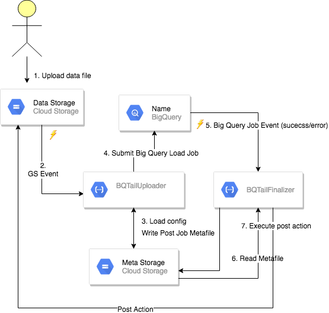

# BigQuery Tail (bqtail)

This library is compatible with Go 1.11+

Please refer to [`CHANGELOG.md`](CHANGELOG.md) if you encounter breaking changes.

- [Motivation](#Motivation)


## Motivation


To goal of this project is to manage google storage based data ingestion of in close to real time without extra cost (i.e. streaming API) and [limitations](https://cloud.google.com/bigquery/quotas).


## Introduction

This project uses GCE cloud functions and Big Query Load API to handle data ingestion.

Two modes are supported:

- Individual: each matched file on google storage is directly loaded to BigQuery table 


- Batched: uploaded file during specified time window are batched per destination table before loading to BigQuery 


On completing data load with error on success you can specify a post action. Currently the following post action are supported: 
- delete
- move data file


## Individual mode




## Batched mode

-- work in progress


## Deployment

```bash

gcloud functions deploy YYYBQTailUploaderFn --entry-point BQTailUploaderFn --trigger-resource XXX --trigger-event google.storage.object.finalize  \n
 --set-env-vars=CONFIG=gs://XXX/config/bqtail.json
--runtime go111
```

Where:
- XXX is bucket name
- YYY is customized name per XXX bucket
- bqtail.json is configuration file
```json
{
  "Rules": {
    "Items": [
      {
        "Source": {
          "Prefix": "/folter/output/",
          "Ext": ".avro"
        },
        "Dest": {
          "TableID": "MY_TABLE",
          "DatasetID": "mydataset"
        },
        "OnSuccess": {
          "Name": "delete"
        }
      }
    ]
  }
}

```
