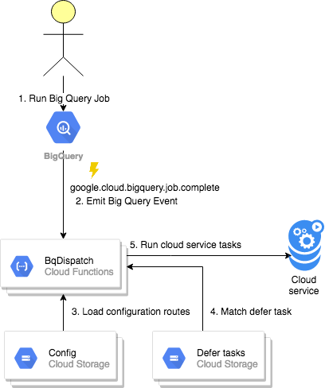

# Dispatch Service

Dispatch service allows you run cloud service task for defer BqTail task or specified source or Big Query destination or job type.
  
- [Introduction](#introduction)
- [Configuration](#configuration)
- [Deployment](#deployment)

## Introduction 

  


Dispatch service run specified task by matching BigQuery Job.
The first matching strategy uses simple JobID matching with google storage ${config.DeferTaskURL}/${JobID}.json, where
jobID has to have suffix: 'dispatch'. The dispatch.json file defines [defer actions.go](../task/actions.go),
for example: [@$JobID.json](usage/dispatch.json) defines on success and or failure actions.

```json
{
  "DeferTaskURL": "gs://${config.Bucket}/tasks/",
  "Async": true,
  "OnSuccess": [
    {
      "Action": "delete",
      "Request": {
        "SourceURL": "gs://${config.Bucket}/data/dataset/table.json"
      }
    }
  ],
  "OnFailure": [
    {
      "Action": "move",
      "Request": {
        "SourceURL": "gs://${config.Bucket}/data/dataset/table.json",
        "DestURL": "gs://${config.Bucket}/errors"
      }
    }
  ]
}
``` 


Another matching method uses configuration routes with [When filter](config/filter.go), 
for example: [@rule.json](usage/rule.json) defines routes and on success and or failure actions.

```json
[
    {
      "When": {
        "Dest": ".+:mydataset\\.my_table_v2",
        "Type": "QUERY"
      },
      "OnSuccess": [
        {
          "Action": "export",
          "Request": {
            "DestURL": "gs://${config.Bucket}/export/my_table.json.gz"
          }
        }
      ]
    },
    {
      "When": {
        "Dest": ".+:mydataset\\.my_table_v3",
        "Type": "LOAD"
      },
      "OnSuccess": [
        {
          "Action": "copy",
          "Request": {
            "Dest": "mydataset.my_table_v4"
          }
        }
      ]
    }
]
``` 


### Configuration

**Configuration options:**

- JournalURL: job history location 
- ErrorURL: - errors location
- DeferTaskURL: transient storage location for managing deferred tasks (both BqTail and BqDispatch have to use the same URL) 
- RulesURL: base URL where each rule is JSON file with routes arrays
  
**Individual rule** can has the following attributes:


- When defines matching filter 
    - Dest: destination table reg expressions against event dest table in the format: project:dataset.table
    - Source: destination table reg expressions against event source table in the format: project:dataset.table
    - Type: big query job type (can be empty), QUERY, LOAD, COPY, EXPORT
    
- OnSuccess: actions to run when job completed without errors
- OnFailure: actions to run when job completed with errors


Post actions can use predefined [Cloud Service](../service/README.md) operation.

### Deployment

```bash
gcloud functions deploy BqDispatch --entry-point BqDispatchFn --trigger-resource projects/MY_PROJECT_ID/jobs/{jobId} --trigger-event google.cloud.bigquery.job.complete  \n
 --set-env-vars=CONFIG=gs://${configBucket}/BqDispatch/config.json
--runtime go111
```

Where:
- gs://${configBucket}/BqDispatch/config.jsonis configuration file
```json

{
  "BatchURL": "gs://${opsBucket}/BqDispatch/Batch/",
  "ErrorURL": "gs://${opsBucket}/BqDispatch/Errors/",
  "JournalURL": "gs://${opsBucket}/BqDispatch/Journal/",
  "DeferTaskURL": "gs://${dispatchBucket}/BqDispatch/Tasks/",
  "RulesURL": "gs://${configBucket}/BqDispatch/Rules/",
  "CheckInMs": 10
}
```

See [Generic Deployment](../deployment/README.md) automation and post deployment testing  