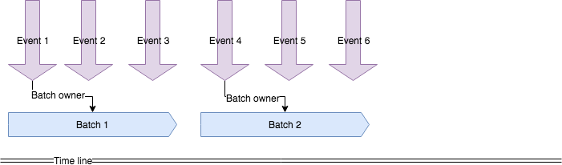

# Batch - storage based event batching

## Introduction

To manage events batching, each event is write transfer file to stageURL/dest/EVENT_ID.tnf file with event source URL.
Each event process try to acquire window to manage the batch, but ony the instance, which transfer file is the first of that window can do so.
After batch is acquired window file is saved to stageURL/dest/<WindowEndTimeNano>.win
Both transfer files modification time and previous window file end time is used to identify which event is the first in the batch.


 
## Service

The batch service defines the following operation:

```go
type Service interface {

	//Add adds transfer events to batch stage
	Add(ctx context.Context, request *contract.Request, rule *config.rule) error

	//Try to acquire batch window
	TryAcquireWindow(ctx context.Context, request *contract.Request, rule *config.rule) (*Window, error)

	//MatchWindowData updates the window with the window span matched transfer datafiles
	MatchWindowData(ctx context.Context, now time.Time,  window *Window, rule *config.rule) error

} 
```